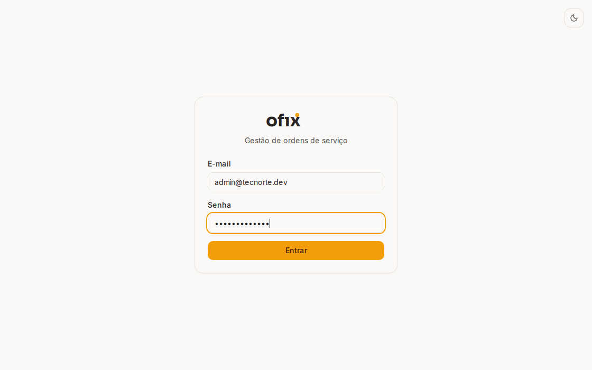
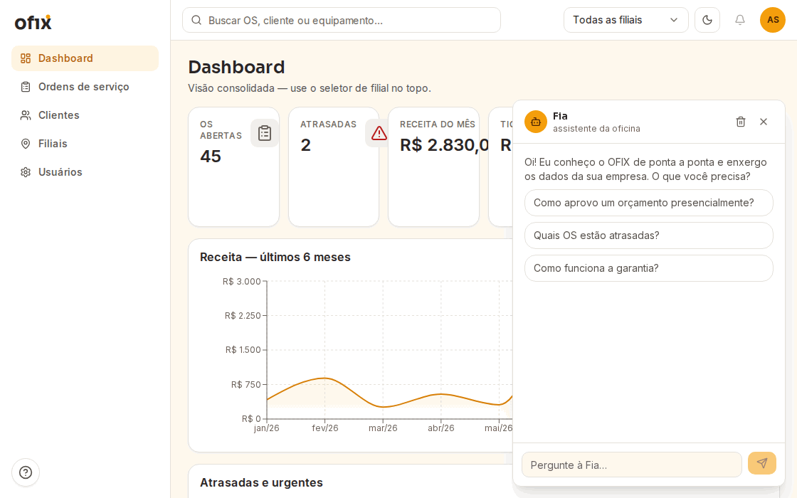

<div align="center">

# ofıx<sup>•</sup>

**Gestão de ordens de serviço para assistências técnicas** — multi-tenant, com filiais, aprovação de orçamento pelo cliente via link (sem login), garantia de 90 dias, tour guiado e assistente integrada.

[](https://github.com/ccpnexatech/ofix/actions/workflows/ci.yml)
[](LICENSE)



</div>

## Demo

> 🔗 **Links de produção em breve** (deploy free tier — a primeira requisição pode levar ~50s pelo cold start do Render).

| Usuário | Papel | Vê o quê |
|---|---|---|
| `admin@tecnorte.dev` | Administrador | tudo, 2 filiais |
| `tecnico@tecnorte.dev` | Técnico | só as OS atribuídas a ele (Matriz) |
| `atendente@tecnorte.dev` | Atendente | só a Filial Aldeota |
| `admin@eletrolar.dev` | Admin de OUTRO tenant | nada da TecNorte (isolamento) |

Senha de todos: `ofix-demo-123`. O seed imprime também **dois links públicos** (orçamento aprovável sem login e mapa de filiais) — em produção eles ficam aqui.

### Fia, a assistente — sem LLM, de propósito



O chat responde com **dados reais do tenant** (tools com escopo) e recortes da documentação — via um respondedor **determinístico local, custo zero e incapaz de alucinar por construção** ([ADR-012](docs/adr/012-assistente-deterministica-local.md): "a IA paga é uma Ferrari para arar uma fazenda"). O caminho com a API da Anthropic está implementado e a uma env var de distância (`ASSISTANT_MODE=anthropic`).

## Arquitetura

```mermaid
flowchart LR
    subgraph Cliente final — sem login
        Q["/q/{token}\norçamento"] & M["/m/{token}\nmapa de filiais"]
    end
    subgraph web [apps/web — Next.js 15]
        UI[App Router + React 19\nTanStack Query · RHF · Tailwind v4]
    end
    subgraph api [apps/api — NestJS 11]
        G[Guards JWT + RBAC\nTenantContext via ALS] --> S[Services + máquina de estados]
        S --> P[(PostgreSQL 16\nPrisma 6 + extensão de tenant)]
        S --> FIA[Fia: tools read-only\n+ docs no prompt]
    end
    Q & M & UI -- "proxy same-origin /api/v1/*" --> G
    SH[packages/shared\nZod 4 · máquina de estados] -.tipos e regras únicos.-> UI & S
```

- **Isolamento multi-tenant estrutural**: toda query passa por uma [Prisma Client Extension](docs/adr/002-multi-tenant-por-coluna.md) que injeta o `tenantId` do `AsyncLocalStorage` — esquecer um filtro é impossível, e cada endpoint tem teste de isolamento.
- **Uma máquina de estados pura** em `packages/shared` governa as transições da OS **na API e na UI** — os botões que você vê são os mesmos que o servidor aceita.
- **Auditoria append-only**: cada mudança vira evento imutável (quem, quando, por qual via — equipe, cliente pelo link, sistema).

## Stack (o porquê de cada peça)

| Peça | Por quê |
|---|---|
| pnpm workspaces + Turborepo 2 | tipos compartilhados de verdade entre api/web/shared |
| NestJS 11 | DI e guards maduros para RBAC + interceptor de tenant |
| Prisma 6 + PostgreSQL 16 | client extension = isolamento de tenant no nível da infraestrutura |
| Next.js 15 (App Router) + React 19 | páginas públicas em SSR + proxy same-origin (cookies sem CORS) |
| Zod 4 no `shared` | um schema valida no form E na API |
| Tailwind v4 + Radix | design system próprio com tokens e temas ([/design](apps/web/src/app/design)) |
| Vitest 3 + Supertest + Playwright | 314 testes + 6 fluxos E2E no CI |
| react-leaflet + OSM | mapa público sem chave de API |

## Rodar local (5 comandos)

```bash
pnpm install
docker compose up -d
pnpm db:migrate
pnpm db:seed        # imprime credenciais e os links públicos
pnpm dev            # web :3000 · api :3001
```

Detalhes e deploy (Neon + Render + Vercel): [docs/setup.md](docs/setup.md).

## Como testar

```bash
pnpm test                      # 314 unit/integração (api + web + shared)
pnpm build && pnpm test:e2e    # 6 fluxos Playwright contra a stack real
pnpm shots                     # regenera o pacote de screenshots do guia
```

O CI roda lint, typecheck, testes com cobertura (artifact), build, auditoria de dependências, verificação do contexto da assistente e o E2E em PRs.

## Documentação

| | |
|---|---|
| [Guia de uso](docs/user-guide.md) | o manual que um dono de assistência leria (11 seções, FAQ, glossário) |
| [Specs 000–012](specs/000-master.md) | a fonte de verdade que governou cada fase |
| [ADRs](docs/adr/) | as decisões com contexto e trade-offs |
| [Regras de negócio](docs/business-rules.md) | RN-01..RN-15 + máquina de estados |
| [Referência da API](docs/api-reference.md) | todos os endpoints com curl real |
| [Banco de dados](docs/database.md) | ERD + dicionário |
| [Scripts operacionais](docs/scripts.md) | tenant/filial/usuário/rotação de tokens |
| [Assistente Fia](docs/assistant.md) | arquitetura, prompt, tools, modos |

## Decisões-chave (top 5)

1. [ADR-002 — Multi-tenant por coluna com Prisma Client Extension](docs/adr/002-multi-tenant-por-coluna.md): isolamento que não depende de disciplina humana.
2. [ADR-006 — Endpoint único de transições](docs/adr/006-endpoint-unico-de-transicoes.md): a máquina de estados é A api, não 9 endpoints soltos.
3. [ADR-005 — Token de capacidade para o fluxo público](docs/adr/005-aprovacao-publica-por-token.md): o cliente aprova sem conta, com validade e revogação.
4. [ADR-008 — Sessão com refresh rotativo e revogação de família](docs/adr/008-estrategia-de-sessao.md): roubo de refresh token derruba a cadeia inteira.
5. [ADR-012 — Assistente determinística local](docs/adr/012-assistente-deterministica-local.md): a decisão de **não** usar LLM — ferramenta pelo problema, não pelo hype.

## O que ficou de fora (e por quê)

Evoluções conscientemente adiadas estão em [docs/backlog.md](docs/backlog.md) — ex.: RAG quando os docs crescerem, modelo self-hosted (Ollama), escrita via chat com confirmação, troca de senha self-service. Nada entrou no código fora das specs.

## Autor

**Caio César Passos Viana Ponte** — [NEXATECH](https://www.linkedin.com/company/nexatech-solucoes) · ccpnexatech@gmail.com

Projeto de portfólio construído com specs como fonte de verdade, commits atômicos e PRs por fase — o [histórico](https://github.com/ccpnexatech/ofix/pulls?q=is%3Apr+is%3Amerged) conta a história.
