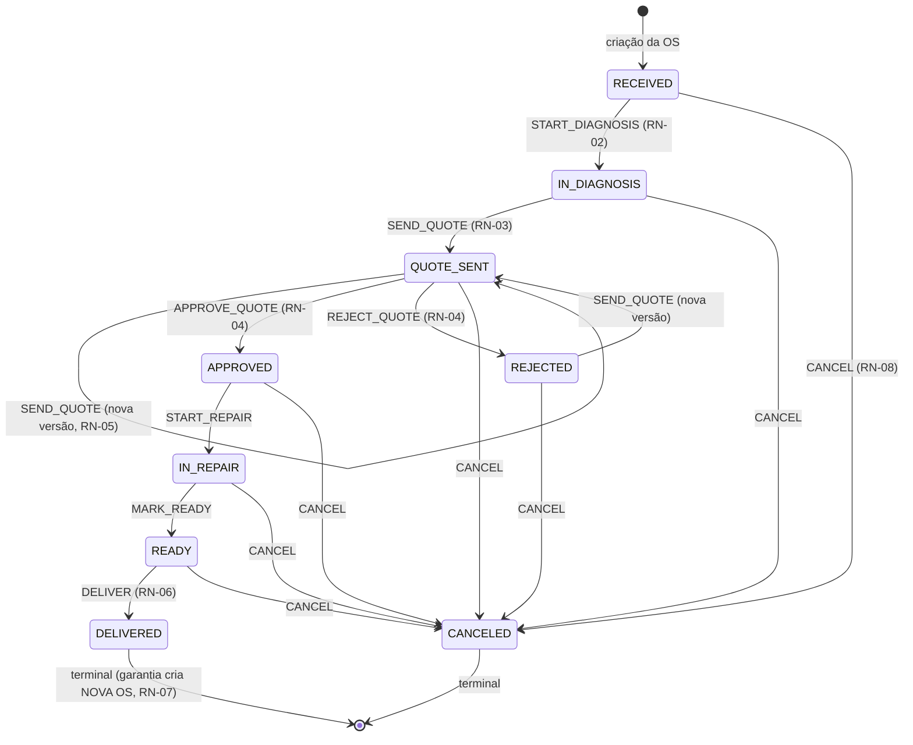

# Regras de negócio (RN-01..RN-15)

Fonte: spec 004. Cada regra tem teste com o código no nome (`pnpm test` em
`apps/api` e `packages/shared`). A máquina de estados é uma função pura em
[`packages/shared/src/order-state-machine.ts`](../packages/shared/src/order-state-machine.ts),
consumida pela API (validar) e pelo web (decidir botões) — divergência é
impossível por construção.

## Máquina de estados da OS

A API muda status **somente** por `POST /orders/:id/transitions { action }`
([ADR-006](adr/006-endpoint-unico-de-transicoes.md)). `REOPEN_WARRANTY` não é
uma transição: cria uma OS filha vinculada e a original permanece DELIVERED.

## Regras de transição e domínio

- **RN-01 — Transição fora do mapa → 422.** Ex.: `DELIVER` numa OS
  `IN_DIAGNOSIS` responde `422 { details: { code: "RN-01" } }`. O teste cobre o
  produto cartesiano completo status × ação (72 combinações).
- **RN-02 — Diagnóstico exige técnico.** `START_DIAGNOSIS` sem
  `assignedTechnicianId` → 422 RN-02. Atribua antes com `POST /orders/:id/assign`.
- **RN-03 — Envio de orçamento.** `SEND_QUOTE` exige `technicalDiagnosis` com
  ≥ 20 caracteres E um orçamento DRAFT com ≥ 1 item e total > 0. Ao executar, o
  orçamento vira SENT com `publicToken` novo e validade de 7 dias.
- **RN-04 — Decisão do orçamento.** Aprovação/recusa acontece (a) pelo cliente
  via link público (Fase 4) ou (b) presencialmente por um ADMIN — o evento
  carrega `metadata.method = "in_person"`. Recusa exige motivo ≥ 5 caracteres.
- **RN-05 — Expiração do orçamento** (Fase 4): quote SENT com token vencido é
  tratada como EXPIRED (avaliação lazy + varredura diária); a OS permanece
  QUOTE_SENT e uma versão N+1 pode ser criada. Link expirado → 410 Gone.
- **RN-06 — Entrega.** `DELIVER` grava `deliveredAt = now` e
  `warrantyUntil = deliveredAt + 90 dias`. Ex.: entregue em 10/06 → garantia
  até 08/09.
- **RN-07 — Reabertura em garantia.** Só com `now <= warrantyUntil` (senão 422
  citando a data). Cria NOVA OS: `warrantyParentId` aponta para a original,
  mesma filial/cliente/equipamento, prioridade mínima HIGH (URGENT é
  preservada), status RECEIVED. Mão de obra dos mesmos serviços não é
  recobrável — a quote da OS de garantia nasce com itens LABOR zerados (Fase 4).
- **RN-08 — Cancelamento.** Exige motivo ≥ 10 caracteres, é terminal e proibido
  a partir de DELIVERED (que só sai via garantia).
- **RN-09 — Auditoria transacional.** Toda transição grava `OrderEvent` na
  MESMA `$transaction` ([ADR-004](adr/004-auditoria-append-only.md)). Falhou o
  evento, falhou a transição. `GET /orders/:id/events` é a linha do tempo.
- **RN-10 — Código da OS.** `OS-{ANO}-{NNNN}` sequencial por tenant+ano via
  `OrderCodeSequence` com `INSERT ... ON CONFLICT` + incremento atômico na
  transação de criação. Teste: 20 criações paralelas → 20 códigos únicos.

## Multi-tenant e filial

- **RN-11 — Isolamento de tenant.** Imposto pela Prisma Extension (ADR-002);
  todo endpoint tem teste `expectTenantIsolation` (tenant B → 404/403 em
  recurso do tenant A).
- **RN-12 — Escopo de filial.** Usuário com `branchId` fixo só enxerga/opera OS
  da sua filial (lista é forçada; pedir outra filial → 403; criar em outra
  filial → 403). `branchId = null` → tenant inteiro.
- **RN-13** (= RN-10 por escopo): a sequência é por tenant — dois tenants podem
  ter cada um a sua `OS-2026-0001` (testado).
- **RN-14 — Dashboard** (Fase 7): agregação padrão = tenant; `?branchId=`
  filtra; usuário de filial fixa não consulta agregado de outra filial (403).
- **RN-15 — Mapa público** (Fase 7): `publicMapToken` expõe SOMENTE filiais
  ativas com lat/lng (nome, endereço, telefone, cidade). Nunca OS, clientes ou
  usuários. Token rotacionável via `scripts/rotate-map-token.ts`.

## Matriz de permissões

Aplicada em dois níveis: `@Roles()` na rota e regras por ação no service de
transições (técnico só opera OS atribuídas a si). Testada de forma tabular
(`test.each`, 31 linhas) em
[`permissions-matrix.integration.spec.ts`](../apps/api/src/modules/orders/permissions-matrix.integration.spec.ts).

| Ação | ADMIN | TECHNICIAN | ATTENDANT |
|---|---|---|---|
| Criar OS / cliente / equipamento | ✓ | — | ✓ |
| Atribuir técnico | ✓ | — | ✓ |
| START_DIAGNOSIS / SEND_QUOTE / START_REPAIR / MARK_READY | ✓ | ✓ (só OS atribuídas a si) | — |
| APPROVE/REJECT presencial | ✓ | — | — |
| DELIVER | ✓ | — | ✓ |
| CANCEL | ✓ | — | — |
| REOPEN_WARRANTY | ✓ | — | ✓ |
| Gerenciar usuários do tenant | ✓ | — | — |
| Dashboard agregado (Fase 7) | ✓ | ✗ (apenas suas OS) | ✓ (sua filial; todas se branchId null) |

Campos editáveis da OS por papel (PATCH): ADMIN edita tudo; ATTENDANT edita
`reportedIssue`/`priority`/`promisedAt` (nunca o diagnóstico); TECHNICIAN edita
somente `technicalDiagnosis` de OS atribuídas a si. Por estado: defeito
relatado e diagnóstico congelam após `QUOTE_SENT` (são a base do que o cliente
aprovou); prioridade e prazo seguem editáveis até estado terminal.

## Definições do dashboard (Fase 7, documentadas desde já)

- **Receita** = soma das quotes APPROVED de OS DELIVERED no período (pela
  `deliveredAt`).
- **Tempo médio de reparo** = média de `deliveredAt - createdAt`.
- **OS atrasada** = `promisedAt < now` e status não-terminal.
