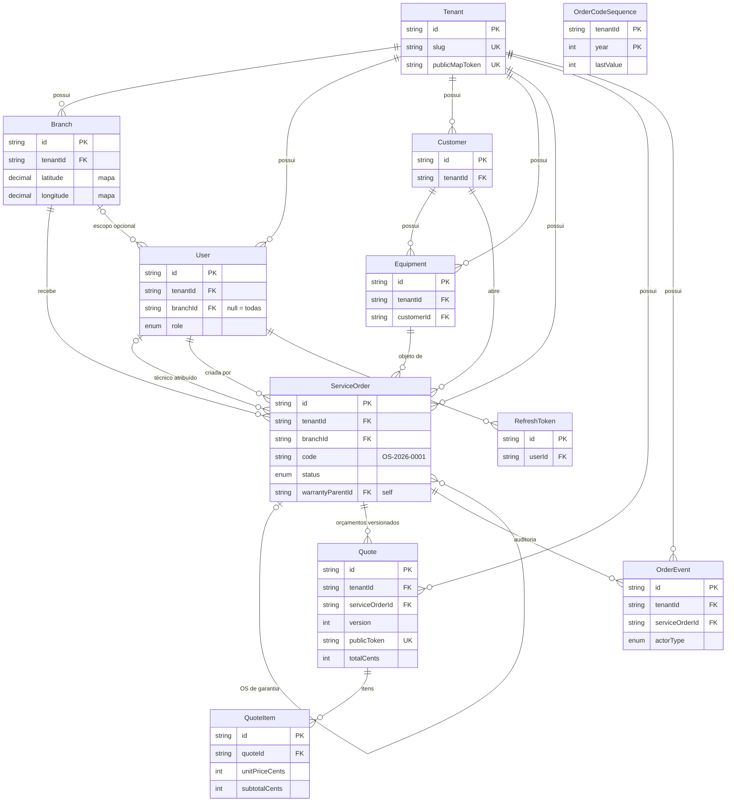

# Banco de dados

Schema PostgreSQL 16 gerido pelo Prisma 6 (`apps/api/prisma/schema.prisma`).
Decisões estruturais: multi-tenancy por coluna `tenantId` com isolamento imposto
em código ([ADR-002](adr/002-multi-tenant-por-coluna.md)) e dinheiro sempre em
centavos inteiros ([ADR-003](adr/003-dinheiro-em-centavos.md)).

- Regenerar o diagrama: `pnpm db:erd` (escreve `docs/assets/erd.svg`).
- Explorar os dados localmente: `pnpm db:studio` (Prisma Studio em http://localhost:5555).
- Migrations: `pnpm db:migrate` (dev) · seed: `pnpm db:seed`.

## ERD

Versão Mermaid (simplificada — cardinalidades e chaves):

## Relacionamentos em linguagem natural

- **Tenant → Branch (1:N).** Cada empresa tem uma ou mais filiais. A filial é o
  nível operacional: é nela que equipamentos entram e saem.
- **Tenant → User / Customer / Equipment / ServiceOrder / Quote / OrderEvent (1:N).**
  Tudo que é dado de domínio pertence a exatamente um tenant — é a coluna
  `tenantId` que a extension de isolamento injeta em toda query (ADR-002).
- **Branch → User (1:N, opcional).** Um usuário pode ser restrito a uma filial
  (`branchId` preenchido) ou enxergar o tenant inteiro (`branchId` null) — caso
  típico do ADMIN e de gerentes multi-filial.
- **Branch → ServiceOrder (1:N, obrigatório).** Uma OS sempre pertence a uma
  filial, porque o equipamento está fisicamente em algum lugar: recepção,
  bancada e entrega acontecem numa filial concreta. É isso que permite dashboard
  e métricas por filial.
- **Customer → Equipment (1:N).** O histórico de um equipamento (várias OS ao
  longo do tempo) só faz sentido se o equipamento é uma entidade própria, não um
  campo de texto na OS.
- **Customer/Equipment → ServiceOrder (1:N).** A OS liga o dono e o objeto do
  reparo. `equipmentId` é obrigatório: não existe OS sem equipamento.
- **User → ServiceOrder (duas relações).** `createdById` (quem registrou a
  entrada — obrigatório, parte da auditoria) e `assignedTechnicianId` (quem está
  com o reparo — opcional até a triagem).
- **ServiceOrder → ServiceOrder (self-relation de garantia).** Uma OS de
  garantia aponta para a OS original via `warrantyParentId`; a original lista
  suas reaberturas. Mantém o vínculo sem duplicar dados do equipamento.
- **ServiceOrder → Quote (1:N versionado).** Orçamento recusado não é editado:
  cria-se nova versão (`version` 1, 2, 3...) e o histórico fica íntegro. O
  cliente aprova/recusa pela página pública `/q/{publicToken}`, sem login.
- **Quote → QuoteItem (1:N, cascade).** Itens (peça ou mão de obra) vivem e
  morrem com o orçamento (`onDelete: Cascade`). `QuoteItem` não tem `tenantId`:
  só é alcançável através do seu `Quote`, que é tenant-scoped.
- **ServiceOrder → OrderEvent (1:N, append-only).** Toda mudança relevante vira
  evento imutável (quem, quando, de onde para onde). É a fonte da linha do tempo
  da OS e nunca sofre update/delete.
- **User → RefreshToken (1:N, cascade).** Sessões com refresh rotativo (spec
  003). Sem `tenantId` próprio: o token é procurado pelo hash durante o refresh,
  antes de existir um escopo de tenant na request.
- **OrderCodeSequence (sem relações).** Tabela utilitária com chave composta
  `(tenantId, year)` que gera o sequencial do código da OS (RN-13) com
  incremento atômico — sem corrida quando duas OS são criadas no mesmo instante.

## Dicionário de dados

Campos padrão omitidos das tabelas: `id` (uuid, PK), `createdAt`
(timestamp, default `now()`).

### Tenant — a empresa cliente da plataforma

| Campo | Tipo | Regra | Exemplo |
|---|---|---|---|
| name | String | obrigatório | TecNorte Assistência |
| slug | String | único global; minúsculas/números/hífens; usado em URLs | tecnorte |
| document | String? | CNPJ, livre | 12.345.678/0001-90 |
| publicMapToken | String | único, uuid; dá acesso ao mapa público `/m/{token}`; rotacionável via script | 45664917-b19a-... |
| isActive | Boolean | default true; desativação lógica | true |

### Branch — filial

| Campo | Tipo | Regra | Exemplo |
|---|---|---|---|
| tenantId | String | FK Tenant; única com `name` | — |
| name | String | único por tenant | Filial Aldeota |
| phone | String? | livre | (85) 3222-2000 |
| address | String | endereço legível completo | Av. Santos Dumont, 1500 |
| city / state | String | UF com 2 letras | Fortaleza / CE |
| zipCode | String? | CEP | 60150-160 |
| latitude / longitude | Decimal(9,6)? | sem elas a filial não aparece no mapa | -3.732700 / -38.496700 |
| isActive | Boolean | default true | true |

### User — usuário interno (funcionário do tenant)

| Campo | Tipo | Regra | Exemplo |
|---|---|---|---|
| tenantId | String | FK Tenant; único com `email` | — |
| branchId | String? | FK Branch; null = acesso a todas as filiais | — |
| name | String | obrigatório | Carlos Lima |
| email | String | único por tenant, minúsculas | tecnico@tecnorte.dev |
| passwordHash | String | Argon2id; nunca a senha em claro | $argon2id$... |
| role | Role | ADMIN \| TECHNICIAN \| ATTENDANT | TECHNICIAN |
| isActive | Boolean | default true | true |
| completedTours | String[] | ids dos tours guiados concluídos (spec 009) | ["orders-list"] |

### Customer — cliente final da assistência

| Campo | Tipo | Regra | Exemplo |
|---|---|---|---|
| tenantId | String | FK Tenant | — |
| name | String | obrigatório | Maria Silva |
| phone | String | obrigatório (principal canal de contato) | (85) 99999-0000 |
| email | String? | opcional | maria@gmail.com |
| document | String? | CPF/CNPJ | 123.456.789-00 |
| address / notes | String? | livres | — |

### Equipment — equipamento de um cliente

| Campo | Tipo | Regra | Exemplo |
|---|---|---|---|
| tenantId | String | FK Tenant | — |
| customerId | String | FK Customer | — |
| type | String | categoria livre | Notebook |
| brand / model | String | obrigatórios | Dell / Inspiron 15 |
| serialNumber | String? | opcional | BR123456 |
| notes | String? | estado de entrada, riscos, acessórios | "tampa trincada" |

### ServiceOrder — ordem de serviço

| Campo | Tipo | Regra | Exemplo |
|---|---|---|---|
| tenantId | String | FK Tenant; único com `code` | — |
| branchId | String | FK Branch; obrigatório | — |
| code | String | "OS-{ano}-{seq}" — sequencial por tenant+ano (RN-13) | OS-2026-0001 |
| customerId / equipmentId | String | FKs obrigatórias | — |
| status | OrderStatus | máquina de estados (spec 004); default RECEIVED | IN_REPAIR |
| priority | Priority | LOW \| NORMAL \| HIGH \| URGENT; default NORMAL | HIGH |
| reportedIssue | String | defeito relatado pelo cliente | "não liga" |
| technicalDiagnosis | String? | preenchido na diagnose | "fonte queimada" |
| assignedTechnicianId | String? | FK User (técnico) | — |
| warrantyParentId | String? | FK ServiceOrder (OS original da garantia) | — |
| promisedAt | DateTime? | prazo prometido; base do indicador de atraso | 2026-06-20 |
| deliveredAt | DateTime? | preenchido na entrega | — |
| warrantyUntil | DateTime? | entrega + 90 dias | 2026-09-18 |
| canceledReason | String? | obrigatório quando status = CANCELED | "cliente desistiu" |
| createdById | String | FK User (quem registrou) | — |
| updatedAt | DateTime | automático | — |

### OrderCodeSequence — sequencial de código por tenant+ano

| Campo | Tipo | Regra | Exemplo |
|---|---|---|---|
| tenantId + year | String + Int | PK composta | (uuid, 2026) |
| lastValue | Int | último valor emitido; incremento atômico na transação | 17 |

### Quote — orçamento (versionado por OS)

| Campo | Tipo | Regra | Exemplo |
|---|---|---|---|
| tenantId | String | FK Tenant | — |
| serviceOrderId | String | FK ServiceOrder; único com `version` | — |
| version | Int | 1, 2, 3... por OS; recusou → nova versão | 2 |
| status | QuoteStatus | DRAFT \| SENT \| APPROVED \| REJECTED \| EXPIRED | SENT |
| publicToken | String | único, uuid; página pública `/q/{token}` sem login | — |
| tokenExpiresAt | DateTime? | validade do link público | 2026-06-25 |
| approvedAt / rejectedAt | DateTime? | carimbo da decisão do cliente | — |
| rejectionReason | String? | motivo informado na recusa | "muito caro" |
| totalCents | Int | **centavos** (ADR-003); recalculado a cada mudança de item, na mesma transação | 123450 |

### QuoteItem — item de orçamento

| Campo | Tipo | Regra | Exemplo |
|---|---|---|---|
| quoteId | String | FK Quote (cascade) | — |
| kind | ItemKind | LABOR (mão de obra) \| PART (peça) | PART |
| description | String | obrigatório | "Tela 15.6 FHD" |
| quantity | Int | > 0 | 1 |
| unitPriceCents | Int | **centavos** | 45000 |
| subtotalCents | Int | quantity × unitPriceCents, calculado no servidor | 45000 |

### OrderEvent — auditoria append-only (NUNCA update/delete)

| Campo | Tipo | Regra | Exemplo |
|---|---|---|---|
| tenantId | String | FK Tenant | — |
| serviceOrderId | String | FK ServiceOrder | — |
| actorType | ActorType | USER \| CUSTOMER (via link público) \| SYSTEM | CUSTOMER |
| actorId | String? | id do usuário quando actorType = USER | — |
| type | String | ORDER_CREATED, STATUS_CHANGED, QUOTE_SENT, QUOTE_APPROVED... | STATUS_CHANGED |
| fromStatus / toStatus | OrderStatus? | preenchidos em transições de status | RECEIVED → IN_DIAGNOSIS |
| metadata | Json? | contexto extra do evento | {"quoteVersion": 2} |

### RefreshToken — sessão com refresh rotativo (spec 003)

| Campo | Tipo | Regra | Exemplo |
|---|---|---|---|
| userId | String | FK User (cascade) | — |
| tokenHash | String | hash do token; o valor em claro nunca é persistido | — |
| expiresAt | DateTime | validade | — |
| revokedAt | DateTime? | preenchido na rotação/logout; reuso de token revogado = sessão comprometida | — |

## Índices e justificativas

| Índice | Tipo | Por quê |
|---|---|---|
| Tenant.slug · Tenant.publicMapToken | únicos | resolução de URLs públicas (slug e mapa) em O(log n) |
| Branch (tenantId, name) | único | impede filial duplicada no mesmo tenant; lookup dos scripts |
| Branch (tenantId) | comum | listagem de filiais do tenant (seletor de filial, mapa) |
| User (tenantId, email) | único | login é por tenant; mesmo e-mail pode existir em tenants diferentes |
| User (tenantId) | comum | listagem de equipe |
| Customer (tenantId, name) | comum | busca de cliente por nome dentro do tenant (autocomplete da recepção) |
| Equipment (tenantId) · Equipment (customerId) | comuns | equipamentos do tenant e histórico por cliente |
| ServiceOrder (tenantId, code) | único | código da OS é único por tenant; busca direta "OS-2026-0001" |
| ServiceOrder (tenantId, status) | comum | kanban/lista filtrada por status — a query mais frequente do sistema |
| ServiceOrder (tenantId, branchId) | comum | dashboard e listagens por filial |
| ServiceOrder (customerId) · (assignedTechnicianId) | comuns | histórico do cliente e fila do técnico |
| OrderCodeSequence (tenantId, year) | PK composta | incremento atômico do sequencial (RN-13) |
| Quote (serviceOrderId, version) | único | garante o versionamento 1..N por OS |
| Quote (publicToken) | comum (+ único) | acesso público `/q/{token}` sem varredura |
| OrderEvent (serviceOrderId, createdAt) | comum | linha do tempo da OS já ordenada |
| RefreshToken (userId) | comum | revogação de todas as sessões de um usuário |

Todos os índices de domínio começam por `tenantId` (quando a tabela é
tenant-scoped) porque **toda** query de domínio filtra por tenant — o índice só
é útil se o prefixo casa com o filtro.

## Limites conhecidos do isolamento (e por que são aceitáveis)

A extension cobre as operações de modelo do Prisma. Ficam fora, por construção:
`$queryRaw`/`$executeRaw` e writes aninhados em relações. Ambos são proibidos em
código de domínio por convenção e revisão (ADR-002); os testes de isolamento de
cada endpoint (spec 008) são a rede de segurança.
