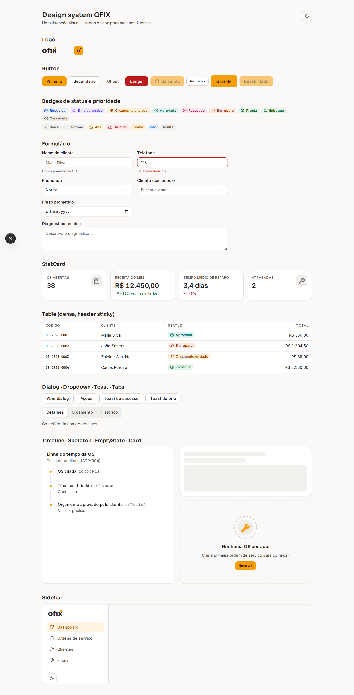
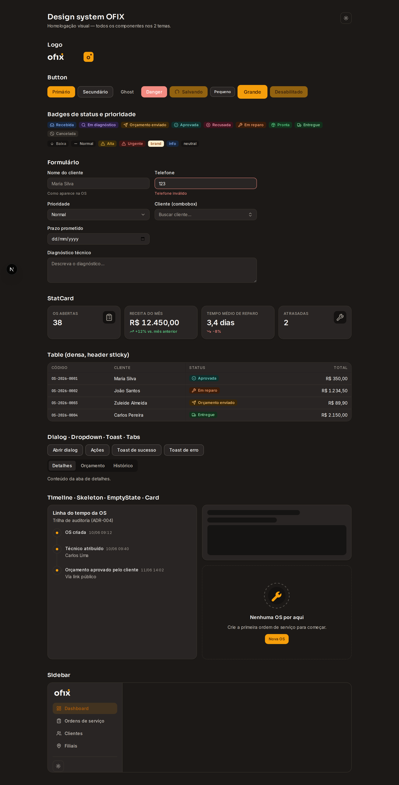

# Design system OFIX

Fonte: spec 007. Tudo vive em `apps/web/src/design-system/`; a homologação
visual é a rota interna **`/design`** (dev-only — 404 em produção), que exibe o
inventário completo nos dois temas.

## Filosofia

**Oficina moderna**: precisão técnica com calor humano. Âmbar/laranja queimado
(`brand-500 #F59E0B`) sobre neutros levemente quentes (stone). Denso de
informação sem poluição. **Status é sempre comunicado por cor + ícone + texto —
nunca só cor** (daltonismo e impressão em P&B agradecem). Componentes **nunca
referenciam cor crua**: consomem tokens semânticos que trocam de valor com o
tema.

## Tokens

Implementados em [`globals.css`](../apps/web/src/app/globals.css) com Tailwind
v4: escalas estáticas em `@theme` (brand 50–950, fontes, raios, escala
tipográfica 12/14/16/18/24/30/38) e tokens semânticos como CSS variables em
`:root` / `[data-theme='dark']`, mapeados para utilities via `@theme inline`
(`bg-surface`, `text-text-muted`, `bg-status-ready-bg`…).

| Grupo | Tokens |
|---|---|
| Superfícies | `surface`, `surface-raised`, `surface-sunken`, `border`, `border-strong` |
| Texto | `text`, `text-muted`, `text-faint`, `text-on-brand` |
| Semânticos | `success/-bg`, `warning/-bg`, `danger/-bg`, `info/-bg` |
| Status da OS | `status-{received,in-diagnosis,quote-sent,approved,rejected,in-repair,ready,delivered,canceled}` + par `-bg` |
| Geometria | `radius-sm 6px / md 10px / lg 16px`; sombras suaves quentes (nunca preto puro) |

**Contraste AA é testado, não prometido**:
[`design-tokens.spec.ts`](../apps/web/src/design-system/design-tokens.spec.ts)
parseia o CSS real e asserta ≥ 4.5:1 em todos os pares texto/superfície e
status/badge **nos dois temas** (40 asserções). O teste reprovou 6 foregrounds
do tema claro na primeira rodada e forçou a calibração — exatamente o papel
dele.

## Temas

Claro/escuro via `data-theme` no `<html>`: script inline no `<head>` aplica o
cookie `ofix-theme` (ou `prefers-color-scheme` na primeira visita) **antes do
paint** — sem flash. O `ThemeToggle` troca o atributo e persiste o cookie por
1 ano.

## Tipografia

Via `next/font` (self-hosted no build, fallbacks com métricas ajustadas → sem
layout shift): **Inter** para UI (`cv11`, `ss01`, e `tabular-nums` em qualquer
número via `table`/`[data-numeric]`), **Sora** para display (títulos públicos e
logo), **JetBrains Mono** para códigos de OS e valores técnicos.

## Componentes (ADR-009)

Primitivos complexos (Dialog, DropdownMenu, Popover/Combobox, Toast, Tabs,
Select) usam **Radix** copiado para o repositório e **re-estilizado 100% pelos
tokens**; o restante é escrito do zero com **CVA** para variants tipadas:
Button (4 variants × 3 tamanhos + loading), Badge/StatusBadge/PriorityBadge,
Card, Table densa (header sticky, tabular-nums), StatCard (valor + delta),
Skeleton, EmptyState (ilustração SVG própria), Timeline, PageHeader, Sidebar,
ThemeToggle, Logo SVG (full/ícone), Input/Textarea/DatePicker/FormField e
Combobox com busca.

Testes de componente dos críticos em
[`components.spec.tsx`](../apps/web/src/design-system/components.spec.tsx):
Button (variants, bloqueio em loading, `type=button` default), StatusBadge
(ícone + texto + token por status, labels únicos), Dialog (abre/fecha) e Table
(header sticky).

## Homologação visual — `/design`

Tema claro:

Tema escuro:

