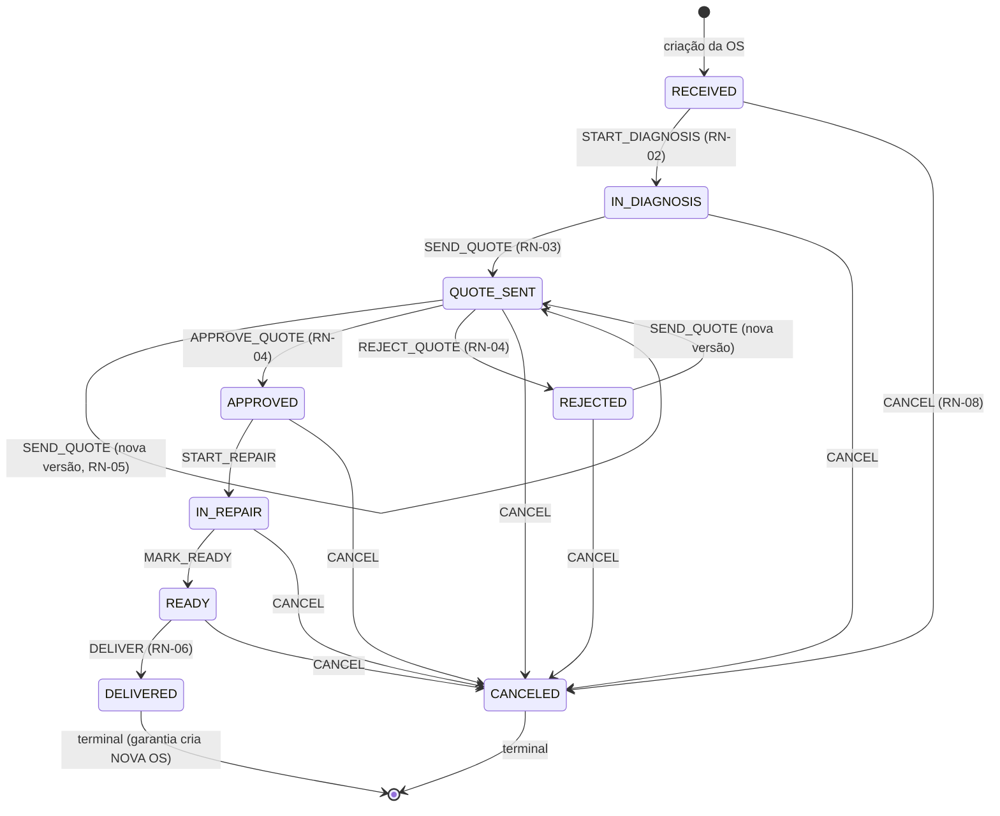
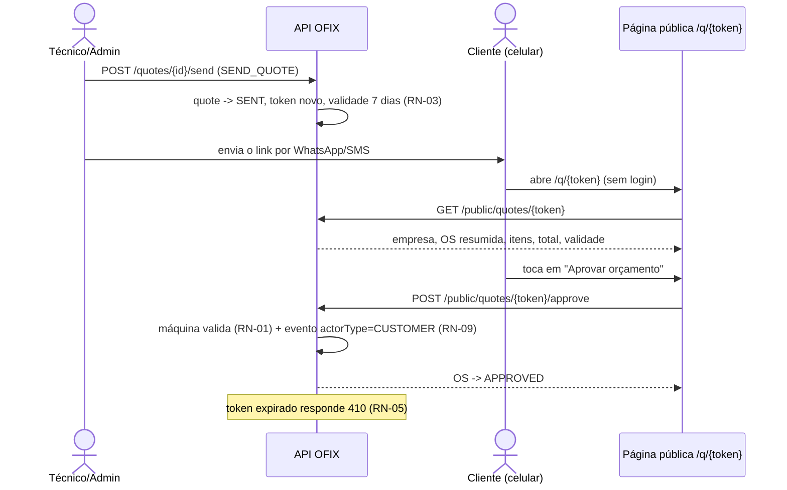
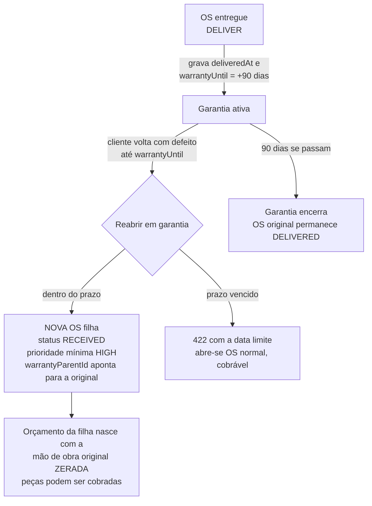

# Fluxos do OFIX

Diagramas de referência dos três fluxos centrais. A máquina de estados é uma
função pura compartilhada entre API e web
([`order-state-machine.ts`](../packages/shared/src/order-state-machine.ts));
as regras citadas (RN-xx) estão detalhadas em
[business-rules.md](business-rules.md).

## Máquina de estados da OS

## Sequência da aprovação pública (ADR-005)

## Fluxo de garantia (RN-06/RN-07)

