# Guia de uso do OFIX

> Este guia foi escrito para quem trabalha no balcão, na bancada ou no caixa de
> uma assistência técnica. Sem jargão: cada passo diz **quem faz**, **onde
> clicar** e **o que acontece**. As imagens são telas reais do sistema.

## 1. O que é o OFIX

O OFIX organiza a vida de uma assistência técnica em volta de um único
documento: a **ordem de serviço (OS)**. Da entrada do aparelho no balcão até a
entrega com garantia, tudo fica registrado — quem mexeu, quando, e o que o
cliente aprovou. Nada se perde em papelzinho ou conversa de WhatsApp.

Cada empresa tem o seu espaço completamente separado das demais, com uma ou
mais **filiais**. O sistema mostra para cada pessoa só o que ela precisa: o
**dono (Administrador)** vê tudo, gerencia a equipe e aprova orçamentos
presencialmente; o **técnico** opera as OS atribuídas a ele — diagnostica,
monta orçamento e executa o reparo; o **atendente** cuida do balcão — cadastra
clientes, abre OS, atribui técnico e entrega o aparelho pronto.

O cliente final não precisa de senha: ele recebe um **link** para ver e
aprovar o orçamento pelo celular, e outro link público mostra as filiais da
empresa no mapa.

## 2. Primeiros passos

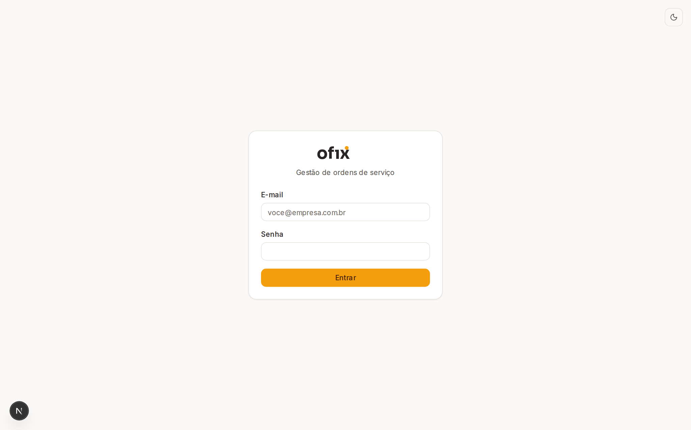
*Legenda: a tela de entrada. O botão de lua/sol no canto superior direito troca
o tema.*

1. Acesse o endereço do sistema e entre com **e-mail e senha** fornecidos pelo
   administrador. Errou a senha? A mensagem é a mesma para qualquer erro — por
   segurança, o sistema nunca confirma se um e-mail existe.
2. **Tema claro ou escuro**: clique no ícone de lua/sol no topo. A escolha fica
   salva — vale na próxima visita, inclusive na tela de login.
3. **Tour guiado**: na primeira vez em cada tela, um passeio rápido destaca o
   que importa. Use **Próximo/Voltar**, ou **Esc** para pular. Quer rever
   depois? Clique no botão **`?`** no canto inferior esquerdo.

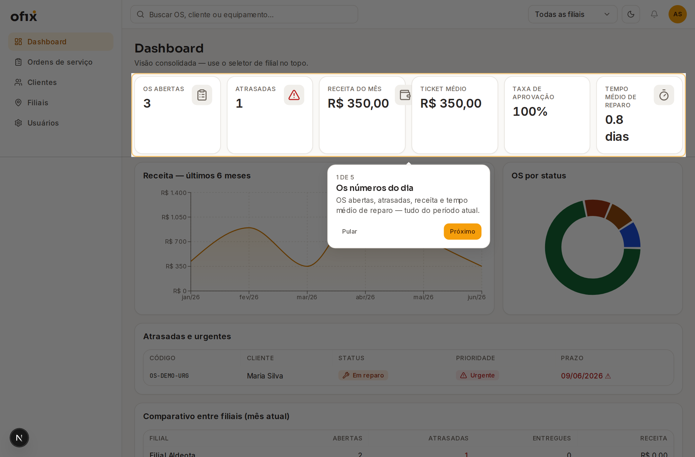
*Legenda: o tour escurece a tela e ilumina, em âmbar, exatamente o elemento
explicado.*

4. **Fia, a assistente**: o balão no canto inferior direito abre um chat que
   conhece este guia e os seus dados — pergunte "quais OS estão atrasadas?" ou
   "como funciona a garantia?".

## 3. A vida de uma OS — a história do notebook da Dona Maria

Acompanhe o caminho completo usando um caso típico: Dona Maria chega ao balcão
da **Matriz Fortaleza** com um notebook que não liga.

### 3.1 Chegada no balcão (atendente ou admin)

No menu lateral, clique em **Ordens de serviço** e depois no botão âmbar
**+ Nova OS**. Um assistente de 4 passos se abre:

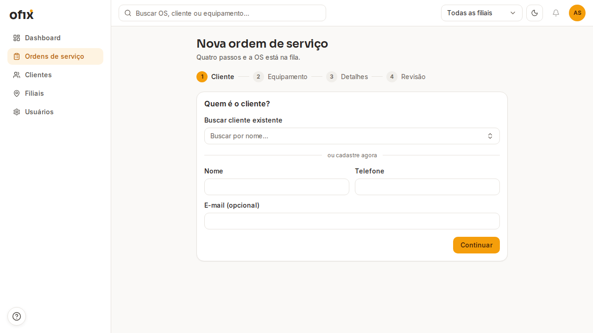
*Legenda: os 4 passos no topo mostram onde você está. Pode voltar sem perder
nada.*

- **Passo 1 — Cliente**: busque pelo nome. Dona Maria é cliente nova? Preencha
  nome e telefone ali mesmo — sem sair do fluxo.
- **Passo 2 — Equipamento**: escolha um aparelho já cadastrado dela ou
  descreva o novo (tipo, marca, modelo).
- **Passo 3 — Detalhes**: escreva o defeito relatado ("não liga após queda de
  energia"), defina a prioridade, a filial e, se prometeu prazo, a data.
- **Passo 4 — Revisão**: confira tudo e clique em **Criar OS**.

O sistema gera um código único, tipo **OS-2026-0042**, e abre a tela da OS. O
status nasce como **Recebida**.

### 3.2 Atribuição do técnico (atendente ou admin)

Na tela da OS, no cartão **Equipamento**, clique em **Atribuir técnico** e
escolha quem vai cuidar do caso. Só aparecem técnicos da filial da OS — o
Carlos, da Matriz, não pode receber OS da Aldeota.

### 3.3 Diagnóstico (técnico)

O Carlos abre a OS e, no painel **Ações** à direita, clica em **Iniciar
diagnóstico**. Esse painel é esperto: só mostra os botões válidos para o
status atual **e** para o papel de quem olha. Depois de examinar o aparelho,
ele clica no lápis ao lado de **Diagnóstico técnico** e descreve o problema
(o sistema pede ao menos 20 caracteres — diagnóstico de uma palavra não ajuda
ninguém).

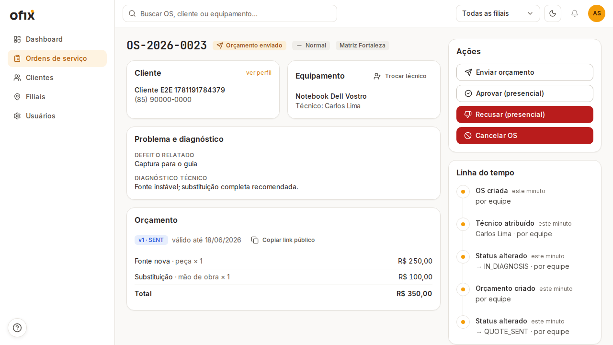
*Legenda: a tela central. À esquerda, cliente, equipamento, diagnóstico e
orçamento; à direita, o painel de Ações e a linha do tempo de tudo o que
aconteceu.*

### 3.4 Montagem do orçamento (técnico ou admin)

No cartão **Orçamento**, clique em **Nova versão** e depois **Adicionar item**
para cada linha: escolha **Peça** ou **Mão de obra**, descreva, informe
quantidade e valor. O total soma sozinho. Clique em **Salvar itens** e, quando
estiver pronto, **Enviar ao cliente**.

### 3.5 O cliente aprova pelo celular

Ao enviar, o orçamento ganha um **link público válido por 7 dias**. No cartão
do orçamento, clique em **Copiar link público** e mande para a Dona Maria por
onde preferir (WhatsApp, SMS).

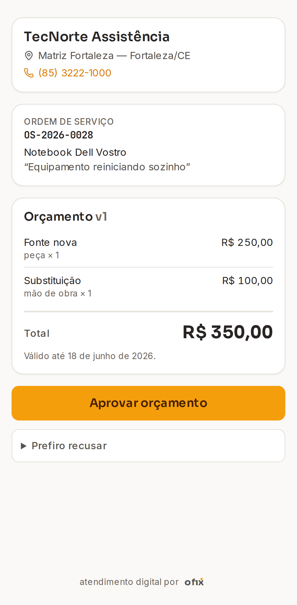
*Legenda: o que a Dona Maria vê no celular — sem instalar nada, sem senha:
a identidade da loja, o aparelho, cada item e o total em destaque.*

Ela confere e toca no botão grande **Aprovar orçamento** (ou em "Prefiro
recusar", informando o motivo). No mesmo instante a OS muda para **Aprovada**
na sua tela, e a linha do tempo registra "pelo cliente · via link público".

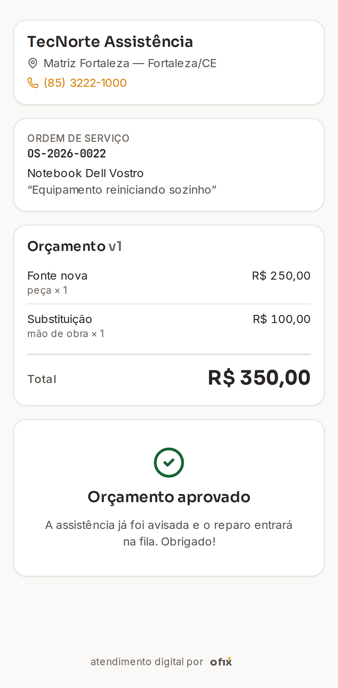
*Legenda: a confirmação que o cliente recebe na hora.*

### 3.6 Reparo e prontidão (técnico)

Com a aprovação, o painel de Ações libera **Iniciar reparo**. Terminou a
bancada? **Marcar como pronta**. A Dona Maria já pode ser avisada.

### 3.7 Entrega (atendente ou admin)

Na retirada, clique em **Entregar**. O sistema grava a data e calcula a
**garantia de 90 dias** automaticamente — o cartão Garantia mostra a data
exata de validade.

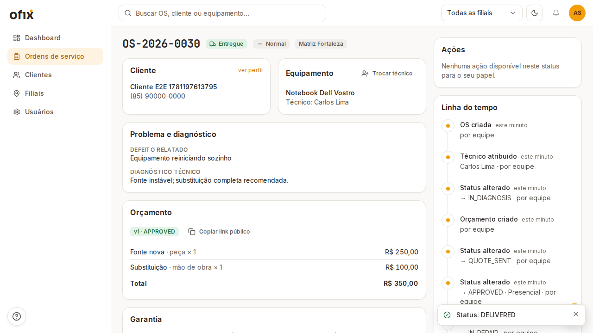
*Legenda: entregue, com a garantia visível. A OS está encerrada — esse status
é definitivo.*

### 3.8 E se o problema voltar? (garantia)

Se o notebook falhar de novo dentro dos 90 dias, abra a OS original e clique
em **Reabrir em garantia**. O sistema cria uma **nova OS** ligada à primeira,
já com prioridade **Alta** — cliente de garantia não espera fila.

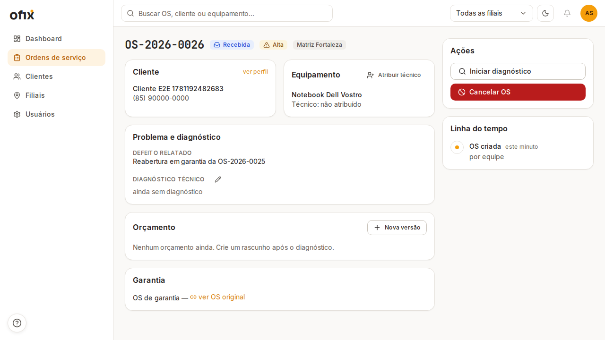
*Legenda: a OS de garantia nasce vinculada — o link "ver OS original" preserva
todo o histórico.*

## 4. Orçamentos em detalhe

- **Peça × mão de obra**: cada item tem um tipo. Isso importa na garantia
  (seção 5) e na leitura do cliente.
- **Versões**: orçamento recusado ou expirado não se edita — cria-se a
  **versão 2** (botão Nova versão). As anteriores ficam guardadas num
  histórico expansível, com motivo da recusa quando houver.
- **Validade de 7 dias**: o link público expira. Se a Dona Maria demorar, o
  link mostra "este orçamento expirou" — basta criar nova versão e reenviar
  (um link novinho é gerado a cada envio).
- **Cliente perdeu o link?** Abra a OS e clique em **Copiar link público** de
  novo — o link atual continua o mesmo até expirar ou ser reenviado.
- **Aprovação presencial**: cliente decidiu no balcão? O **Administrador** usa
  os botões **Aprovar (presencial)** / **Recusar (presencial)** no painel de
  Ações. A recusa pede o motivo (mínimo 5 caracteres) — ele aparece na linha
  do tempo e no histórico de versões.
- **Depois da recusa**: converse com o cliente, monte a versão 2 com outros
  valores e reenvie — ou cancele a OS informando o motivo.

## 5. Garantia sem mistério

A regra dos **90 dias** (contados da entrega) significa: se o mesmo serviço
apresentar problema, **a mão de obra não é cobrada de novo**. Na prática:

- O orçamento da OS de garantia já nasce com os serviços originais **zerados**,
  identificados como "Garantia — ...".
- **Peças novas podem ser cobradas** — se a fonte queimou de novo por outro
  motivo, a peça entra no orçamento normalmente.
- Passou dos 90 dias? O sistema bloqueia a reabertura e mostra a data limite.
  Abra uma OS comum, cobrável.
- Reabrir em garantia **não reabre a OS original** — ela permanece "Entregue"
  para sempre; o reparo novo vive na OS filha, com seu próprio histórico.

## 6. Clientes e equipamentos

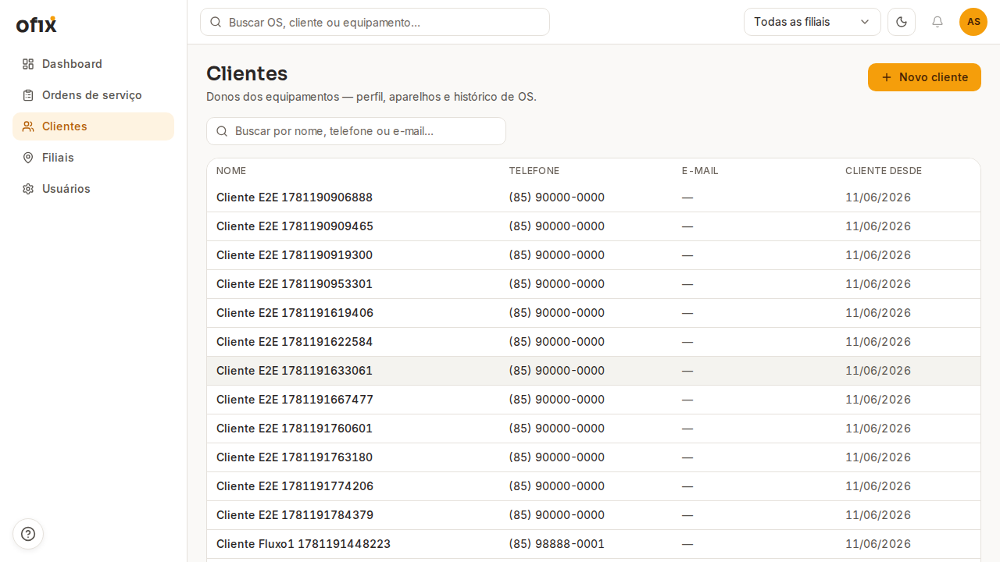
*Legenda: busque por nome, telefone ou e-mail. Clique na linha para abrir o
perfil.*

- **Cadastrar**: botão **Novo cliente** (nome e telefone bastam) — ou direto
  no passo 1 do assistente de OS.
- **Perfil**: contato, todos os equipamentos da pessoa e o histórico completo
  de OS — útil quando o cliente diz "é a terceira vez que esse notebook vem
  aqui".
- **Equipamentos**: um cliente pode ter vários. Cadastre pelo perfil ou no
  passo 2 do assistente. O número de série ajuda a não confundir aparelhos
  iguais.

## 7. Dashboard — os números do negócio

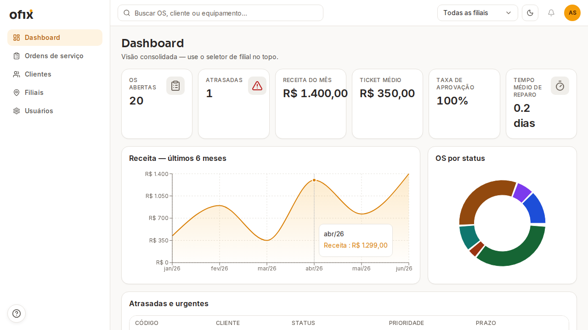
*Legenda: a visão de chegada do dia. No topo direito, o seletor de filial.*

O que cada cartão significa:

| Métrica | Em palavras |
|---|---|
| **OS abertas** | Tudo que ainda não foi entregue nem cancelado |
| **Atrasadas** | OS com prazo prometido já vencido e ainda em andamento |
| **Receita do mês** | Soma dos orçamentos aprovados das OS **entregues** no mês — entrega é o que conta, não a aprovação |
| **Ticket médio** | Receita do mês dividida pelas entregas do mês |
| **Taxa de aprovação** | De cada 100 orçamentos decididos no período, quantos o cliente aprovou |
| **Tempo médio de reparo** | Da entrada do aparelho até a entrega, em dias |

- **Seletor de filial** (topo): "Todas as filiais" ou uma específica — o
  filtro fica no endereço da página, então dá para compartilhar a visão exata.
  Usuário vinculado a uma filial vê o seletor travado nela.
- **Gráfico de receita**: os últimos 6 meses, para enxergar tendência.
- **OS por status**: o anel usa as mesmas cores dos selos de status.
- **Atrasadas e urgentes**: a lista do que precisa de você agora — clique no
  código para abrir.
- **Comparativo entre filiais** (só Administrador): abertas, atrasadas,
  entregas e receita de cada unidade, lado a lado.
- **Análise da IA**: a Fia lê esses mesmos números e devolve um diagnóstico em
  texto — clique em **Gerar análise** quando quiser uma leitura interpretada.

## 8. Filiais e o mapa público

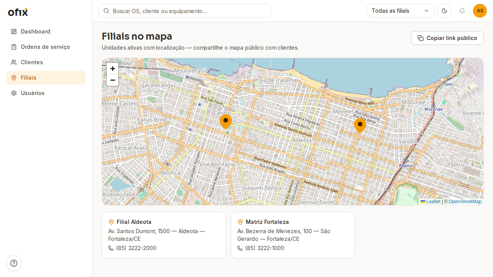
*Legenda: menu Filiais — suas unidades no mapa, com endereço e telefone.*

- Cada OS pertence a **uma** filial (o aparelho está fisicamente em algum
  lugar). Usuários podem ser da filial ou do tenant inteiro — quem é "da
  Aldeota" só vê e opera o que é da Aldeota.
- **Abriu uma unidade nova?** O Administrador cadastra pelo botão
  **Nova filial** (e edita pelo lápis em cada cartão). Preencha latitude e
  longitude para a unidade entrar no mapa — sem elas, fica só na lista.
- **Compartilhe o mapa**: o botão **Copiar link público** gera um endereço que
  qualquer cliente abre sem senha, com pins, telefone clicável e botão "como
  chegar".

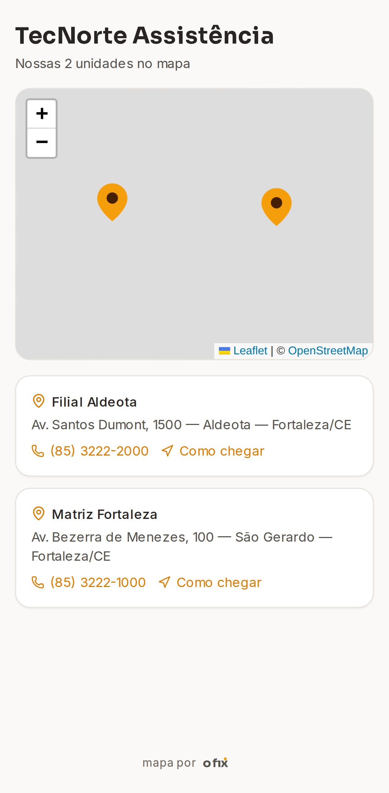
*Legenda: o que o cliente vê — ideal para a bio do Instagram da loja.*

- **Trocar o link** (se vazou onde não devia): a rotação é feita pelo
  operador do sistema via script — veja [scripts.md](scripts.md).
  O link antigo morre na hora.
- Filial sem coordenadas cadastradas não aparece no mapa (a lista avisa).

## 9. Usuários e permissões

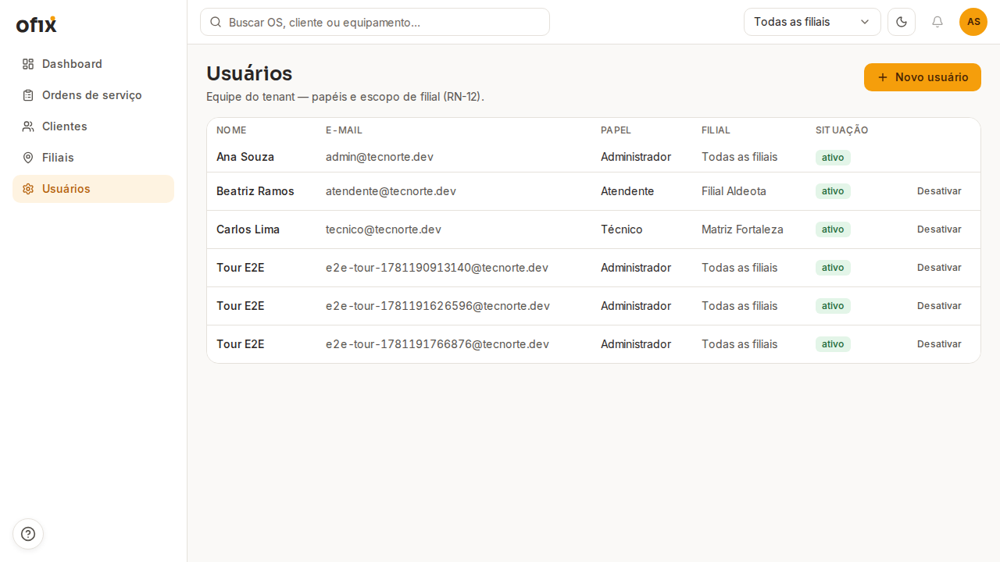
*Legenda: menu Usuários (só o Administrador vê). Crie, desative e defina o
escopo de filial.*

Quem pode o quê, em linguagem direta:

| O que | Admin | Técnico | Atendente |
|---|---|---|---|
| Abrir OS, cadastrar cliente/equipamento | ✓ | — | ✓ |
| Atribuir técnico | ✓ | — | ✓ |
| Diagnosticar, orçar, reparar, marcar pronta | ✓ | ✓ *(só nas OS dele)* | — |
| Aprovar/recusar orçamento no balcão | ✓ | — | — |
| Entregar ao cliente | ✓ | — | ✓ |
| Cancelar OS | ✓ | — | — |
| Reabrir em garantia | ✓ | — | ✓ |
| Gerenciar usuários | ✓ | — | — |
| Dashboard | tudo | só as OS dele | a filial dele (ou todas, se não tiver filial fixa) |

**Criar usuário**: botão **Novo usuário** → nome, e-mail, senha inicial (peça
para trocar no primeiro acesso), papel e filial. "Todas as filiais" = acesso
ao tenant inteiro.

## 10. Perguntas frequentes

1. **O cliente perdeu o link do orçamento. E agora?**
   Abra a OS → cartão Orçamento → **Copiar link público** e reenvie. O link só
   muda quando o orçamento é reenviado ou expira.

2. **O link do orçamento "expirou". O que faço?**
   O link vale 7 dias (segurança: ele dá acesso sem senha). Crie uma **nova
   versão** do orçamento e clique em Enviar — nasce um link novo.

3. **Posso cancelar uma OS entregue?**
   Não. Entregue é estado final — o histórico daquilo que o cliente levou não
   se reescreve. Problema depois da entrega? É caso de **garantia** (nova OS
   vinculada).

4. **Por que não consigo mover a OS para "Em reparo"?**
   O reparo só começa **depois** que o cliente aprova o orçamento. A ordem é
   sempre: diagnóstico → orçamento enviado → aprovado → reparo. O painel de
   Ações só mostra o passo que vale agora.

5. **Por que o botão "Iniciar diagnóstico" não aparece?**
   Duas causas: a OS ainda não tem **técnico atribuído** (atribua primeiro),
   ou você não é o técnico daquela OS — técnico só opera as próprias.

6. **O cliente recusou. Perdi o orçamento?**
   Não — a versão recusada fica no histórico, com o motivo. Monte a versão 2
   (outros valores, outras peças) e reenvie.

7. **Cadastrei o cliente na filial errada. A OS também?**
   Cliente é da empresa toda; o que tem filial é a **OS**. OS criada na filial
   errada: cancele com o motivo e abra na certa — a linha do tempo preserva o
   registro.

8. **Por que o atendente da Aldeota não encontra uma OS da Matriz?**
   Por desenho: usuário com filial fixa só enxerga a unidade dele. Quem
   precisa ver tudo (dono, gerente geral) deve ser cadastrado com "Todas as
   filiais".

9. **A mão de obra é cobrada na garantia?**
   Dos **mesmos serviços**, não — o orçamento da OS de garantia já vem com
   eles zerados. Peças novas e serviços diferentes podem ser cobrados.

10. **Quem aprovou esse orçamento? O cliente jura que não foi ele.**
    Abra a linha do tempo da OS: cada decisão registra quem fez (equipe,
    cliente pelo link, ou sistema), quando, e por qual via — "via link
    público" ou "presencial".

11. **Esqueci minha senha.**
    Peça ao Administrador: ele cria uma senha nova em Usuários (a troca pelo
    próprio usuário está no roteiro de evolução).

12. **O tour sumiu e eu queria rever uma tela.**
    Botão **`?`** no canto inferior esquerdo, em qualquer tela que tenha tour.

## 11. Glossário

| Termo | Significado |
|---|---|
| **OS (ordem de serviço)** | O documento que acompanha um conserto do início ao fim, com código único (ex.: OS-2026-0042) |
| **Orçamento** | A proposta de valores de um conserto, com itens de peça e mão de obra; pode ter várias versões |
| **Garantia** | 90 dias após a entrega em que a mão de obra dos mesmos serviços não é cobrada de novo |
| **Filial** | Unidade física da empresa; toda OS pertence a uma |
| **Tenant** | O espaço isolado da sua empresa no sistema — ninguém de fora enxerga nada |
| **Link público** | Endereço sem senha para o cliente decidir o orçamento (validade 7 dias) ou ver o mapa de filiais |

**Status da OS** (cor do selo em toda tela):

| Selo | Significado |
|---|---|
| 🔵 **Recebida** | Entrou no balcão, aguardando triagem |
| 🟣 **Em diagnóstico** | Técnico investigando o defeito |
| 🟠 **Orçamento enviado** | Aguardando a decisão do cliente |
| 🩵 **Aprovada** | Cliente disse sim — pronta para a bancada |
| 🌹 **Recusada** | Cliente disse não — cabe nova versão ou cancelamento |
| 🟧 **Em reparo** | Mãos à obra |
| 🟢 **Pronta** | Reparo concluído, aguardando retirada |
| ✅ **Entregue** | Cliente levou; garantia correndo (estado final) |
| ⚪ **Cancelada** | Encerrada sem conclusão, com motivo registrado (estado final) |
